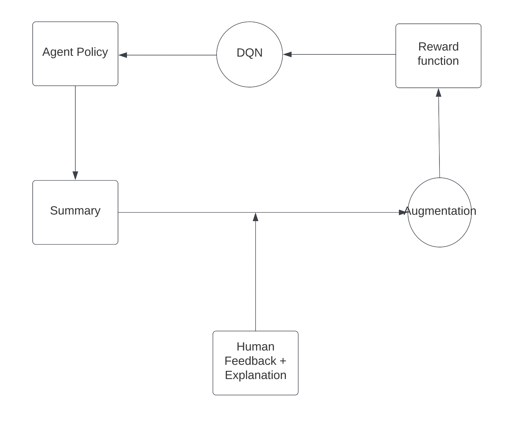
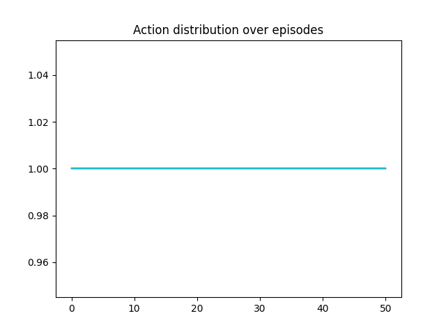
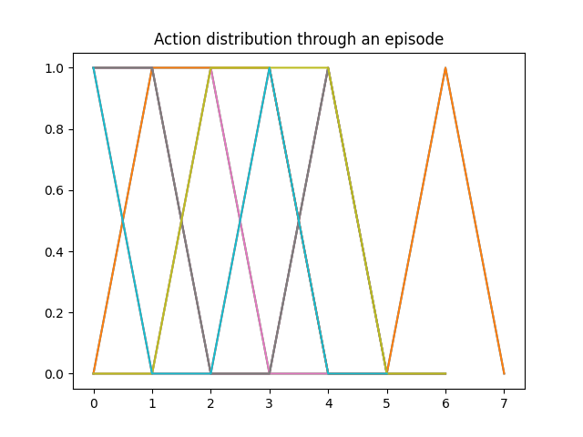
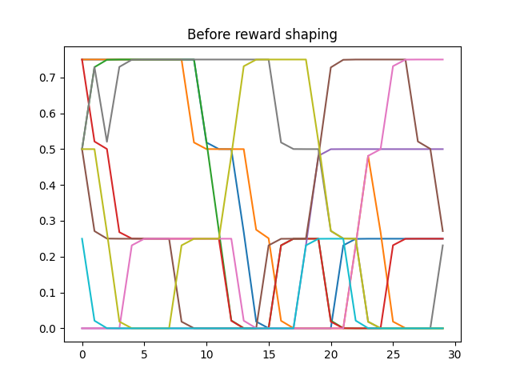
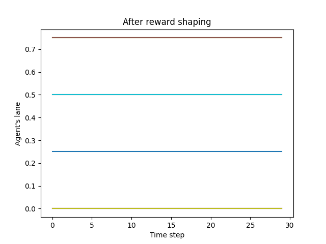
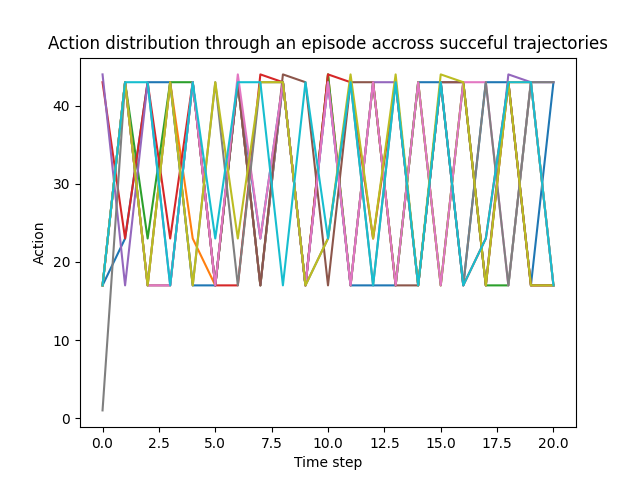
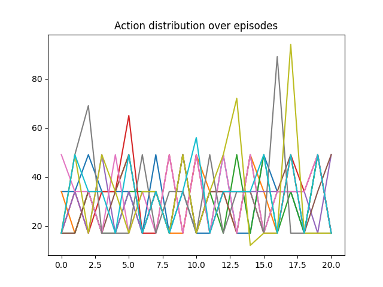
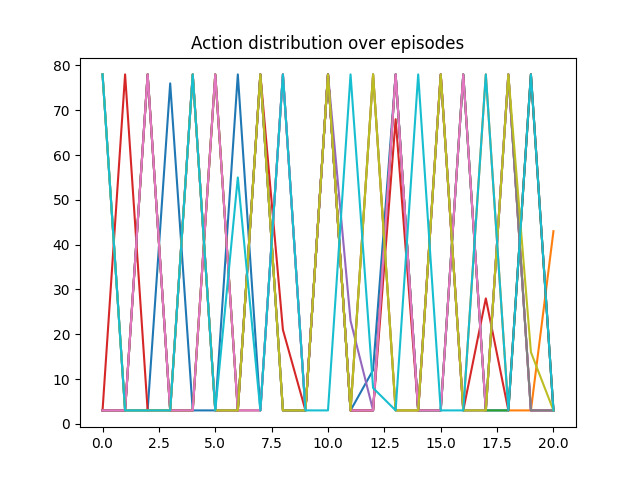

# Interactive Reward Shaping

## Introduction

 * Human feedback is used to augment the existing environment's reward.

 * **Main idea:** give human feedback on trajectory level, instead of for individual *<state, action>* pairs.

 * **Contributions:**
   * Trajectory-level feedback
   * Avoiding the assumption that human knows exact correct action in each state (e.g. continuous state/action spaces or complex behaviors)
   * Allow user to augment the feedback with explanations (e.g. why this behavior should be penalized)
   * Allows capturing more complex behavior (e.g. one lane change is not necessarily a bad action, but repeating it many times is)
   * **Application**: used for correcting reward misspecification, instead of for faster convergence 

## Related Work

### Human-in-the-Loop RL
* User gives feedback on presented <state, action> pairs
* Feedback can be:
  * Binary (good/bad action in the state)
  * Explanation-augmented (good/bad action + explanation, e.g. saliency maps)
  * Demonstration (showing the best action)
* Large amount of user effort

### Preference-based RL

* User is iteratively offered a choice between two trajectories and chooses a better one. 
* Limited feedback (only binary signal is recorded)

### Inverse and Imitation RL
* User demonstrates correct behavior
* User must know how to perform the task
* Requires a large amount of user effort

## Approach

### Algorithm 

Input: 
 * Environment $E$
 * Policy model $M$ (e.g. DQN)
 * Reward shaping model $R_{s}$

Output:
 * Policy $\pi_s$ consistent with user feedback

WHILE True:\
        $B$ =initialize_buffer$(E)$                                     \\\\ initialize buffer with environment trajectories\
        $\pi$ = train$(M, E, R_s)$                                      \\\\ learn partial policy\
        summary  = summarize($\pi, E$)                                  \\\\ summarize policy\
        feedback = get_feedback(summary, user)                          \\\\ gather feedback trajectories and their explanations from the user\
        for each (feedback_trajectory, explanation):      
            $D_A$ = augment_feedback(feedback_trajectory, explanation)  \\\\ augment feedback\
            $B$ =  update_buffer($B, D_A$)                              \\\\ update buffer with augmented feedback

        update_reward_model$(R_s, B)$                                   \\\\ update reward model with feedback data
  

### Trajectory Feedback   

* In what form should human feedback be collected and how should it be integrated in updating the reward model?
* If user marks a behavior $<(s_1, a_1), ..., (s_k, a_k)>$ that should be penalized:
  * **State-based:** 
    * Arriving in s_k from s_1 should be penalized (e.g. arriving in another lane)
    * **Initial solution**: 
      * **Trajectory encoding**: $[s_1 + \delta(s_k, s_1)]$ to capture the difference between starting and ending state. 
      * **Explanation**: offered as a set of important features
      * **Data augmentation**: augmented samples are obtained from the feedback trajectory by randomizing unimportant features.
  * **Action-based** 
    * Performing actions a_1, ..., a_k should be penalized (e.g. changing speed every step)
    * **Initial solution:**
      * **Trajectory encoding:** a list of actions $[a_1, ..., a_k]$
      * **Explanation:** NOT IMPLEMENTED
      * **Data augmentation**: a neighbourhood of action sequences is generated by perturbing the feedback encoding. The most similar action sequences are chosen depending using the Dynamic Time Warping similarity to the feedback action sequence.
  * **Feature-based**
    * NOT IMPLEMENTED
  * Other options?

## Initial Experiments

### Gridworld Environment

Environment reward:
* -1 for moving step
* 0 for turning step
* 1 for reaching goal

Under this reward, agent learns to turn in place, thus keeping cummulative reward at 0. 

For initial experiment, a trajectory where agent makes 4 turns is marked as undesirable

Result: action distribution through successful episodes before vs after reward shaping:

 

### Highway Environment

Environment reward:
* Lane changes not penalized

  

### Inventory Environment

Environment reward:
* Cost for buying items
* Profit for selling
* Cost for not satisfying demand

Results in policy that orders 20 - 40 items each time step, as demand is sampled around 30:

* Assume there is a one-off fee associated with each delivery (regardless of number of items).
Optimal policy would prefer to order less often, but in bigger batches.

* For initial experiment, 5-step trajectories where agent orders 20 - 40 items are marked as undesirable.
* Action-based feedback 
* Action distribution before reward shaping vs. after reward shaping:

 

### Limitations

* Two-step iteration (feedback given only once, when model is half-trained)
* Strong reward shaping signal 
* Only negative reward shaping enabled
* Random forest is used as a predictor
* Only one feedback type per task
* For action feedback, fixed time window
* Naive generation of neighbourhood of a sequence of actions

## Open Questions

* **Summary generation:** How to choose summary of policy to present to the user? How to make sure presented trajectories summaries agent's learned knowledge and not random behavior?
  * Initial solution: showing top 10 trajectories with respect to cummulative reward
* **Feedback augmentation** How to augment user's feedback using the provided explanation?
  * Initial solution: user can provide important features as explanation and augmented samples are generated by randomizing all other features, and maintaining the values of the important ones.
* **Reward shaping** How to learn reward shaping from augmented feedback?
  * Initial solution: linear reward shaping, at each step agent gets $\lambda * additional_reward$ added to original environment reward. additional_reward is predicted by $R_s$ for the agent's trajectory ending in current state 
* **Action-based feedback**: How to augment action-based feedback? What is an explanation in action-based feedback?
